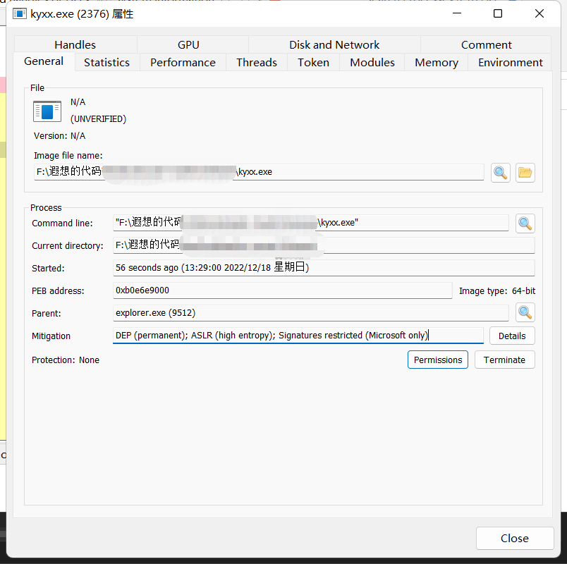

**郑重声明：本程序旨在为正规的RT同胞们提供便捷的帮助，严禁黑灰色产业利用和依靠免杀赚取流量、虚荣心等行为。一经发现将永不更新！！！**

蓝队训练程序生成器 是根据 https://github.com/knownsec/shellcodeloader 的框架进行的二开，因为我实在是太懒了，效果好就行不追求别的。这里延续采用了这个项目的shellcode加密模式，后期可能会对整个框架进行大改刀和重构。重写了原本的权限维持的方法（这里采用了计划任务的方式），添加了修补Etw的功能，重写了反沙箱功能（自己在虚拟机测试请不要开启此功能），目前先公开一个x64的加载模块，用来给各位师傅测试，并提供一些宝贵的意见。为了保障长久有效，请各位师傅不要将 生成的程序 上传到VT和云沙箱等地方（虽然我知道有些人不会听），如果第一个测试模块 被记录的过快的话，将会影响遐想公开的积极性。本程序因为是二开的，所以也不会开源，如果介意的可以断网运行，或者不使用本工具。

如果需要测试效果可以使用antiscan.me平台，他不会和云厂商共享你的样本。

在测试中初代版本和测试模块 新的心跳 的生成文件测试结果如下：

动态的话遐想测试了KES（卡巴斯基EDR），Defender，火绒，和国产之光某数字。全程静默无提示，这里需要注意开启权限维持的话需要UAC启动该程序，遐想并不建议开启此功能。

后期将会添加新的EDR对抗功能和模块。比如unhook等功能。
====================================================================
1.0更新

BlockDll（禁止加载非微软签名dll）

PEB欺骗

挂起EventLog （并不是那么好用）

开源模块代码，可以自己修改填写，用法与https://github.com/knownsec/shellcodeloader相同
